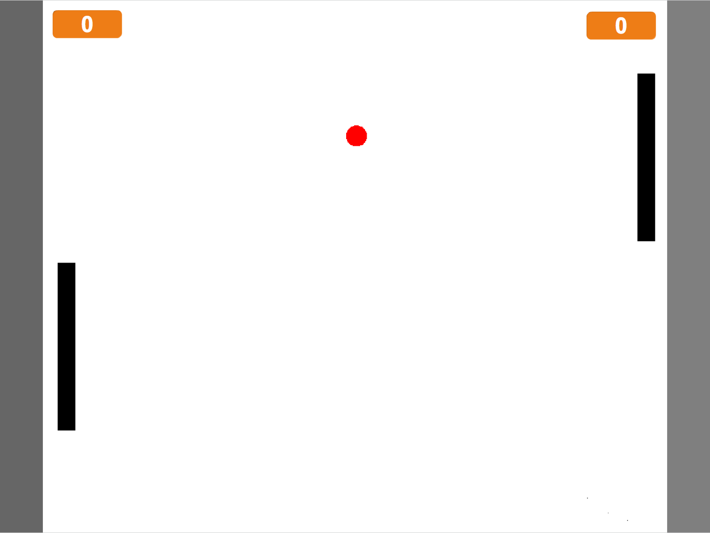
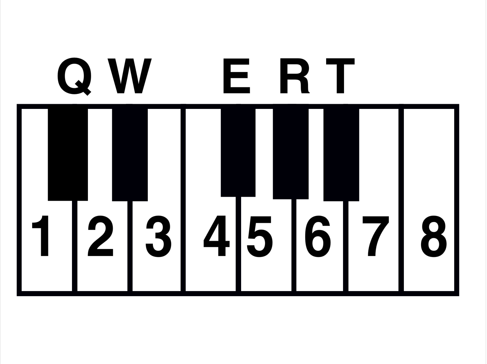
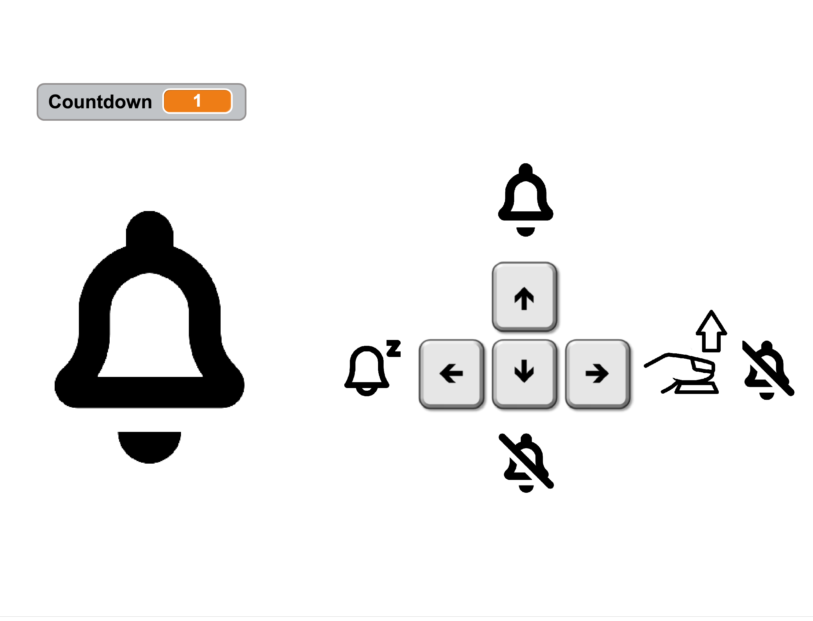

# Makerspace-Werkstatt

## Sa, 08.04. | 10 Uhr | Jella-Lepman-Kabinett | 2.OG

Die Welt ist voller kleiner Probleme: Wer klaut immer den Joghurt aus dem Kühlschrank? Wie kann man mit einer Treppe Klavier Spielen? Da sind tüchtige Erfinderinnen und Erfinder gefragt. Mit Makey Makey kann man jeden Gegenstand in einen Schalter verwandeln. Dazu gibt es allerlei Material wie Knete, Karton, Aluminiumfolie oder Obst mit denen der erste Prototyp gebastelt wird.

Für Kinder von 8 bis 13 Jahren. 
Bitte anmelden unter Tel. 0711 216-96552 oder stadtbibliothek.kinder@stuttgart.de

#### Einführung

Als Einführungs sollen die Kinder eine Idee davon bekommen, was Makey Makey ist und wie es funktioniert. Dazu gibt es zwei einfache Beispiele mit denen die Kinder experimentieren können. 

## Aufgabe: Der Wecker der Zukunft

Im zweiten Teil geht es darum eigene Ideen zu entwickeln. Die Aufgabe lautet: Wie könnte der Wecker der Zukunft aussehen?
Es gibt eine Vorlage mit der man seinen Protoype bauen kann. 

